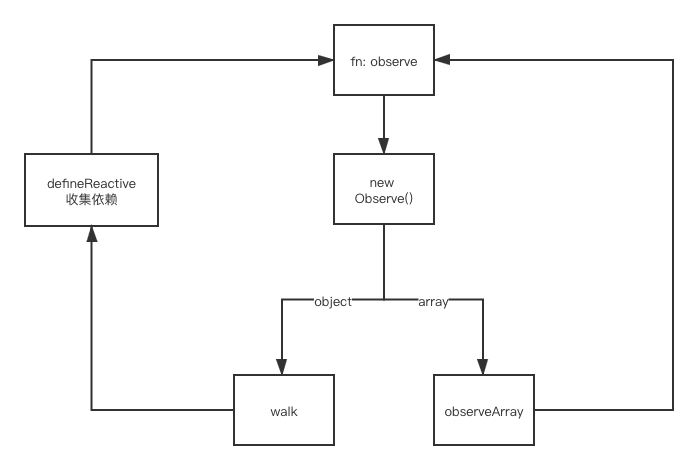

## 1.4 Vue 框架怎么实现对象和数组的监听
递归的给数组和对象添加劫持  

在vue中 简化版源码（剔除掉一些优化和边界判断）
```js
// 工厂模式
export function observe (value){
  let ob
  if ( Array.isArray(value) || isPlainObject(value)) {
    ob = new Observer(value)
  }
  return ob
}

export class Observer {
  constructor (value: any) {
    this.value = value
    this.dep = new Dep()
    if (Array.isArray(value)) {
      this.observeArray(value)
    } else {
      this.walk(value)
    }
  }

  walk (obj: Object) {
    const keys = Object.keys(obj)
    for (let i = 0; i < keys.length; i++) {
      defineReactive(obj, keys[i])
    }
  }

  observeArray (items: Array<any>) {
    for (let i = 0, l = items.length; i < l; i++) {
      observe(items[i])
    }
  }
}

export function defineReactive (obj, key, val, shallow) {
  const dep = new Dep()
  val = obj[key]

  let childOb = !shallow && observe(val)
  Object.defineProperty(obj, key, {
    enumerable: true,
    configurable: true,
    get: function reactiveGetter () {
      const value = val
      if (Dep.target) {
        dep.depend()
        if (childOb) {
          childOb.dep.depend()
          if (Array.isArray(value)) {
            dependArray(value)
          }
        }
      }
      return value
    },
    set: function reactiveSetter (newVal) {
      const value = val
      val = newVal
      childOb = !shallow && observe(newVal)
      dep.notify()
    }
  })
}
```
__对象__
```js
let childOb = !shallow && observe(val)
```
__数组__ 
```js
observeArray (items: Array<any>) {
  for (let i = 0, l = items.length; i < l; i++) {
    observe(items[i])
  }
}
```


看了这张图就很清晰了
